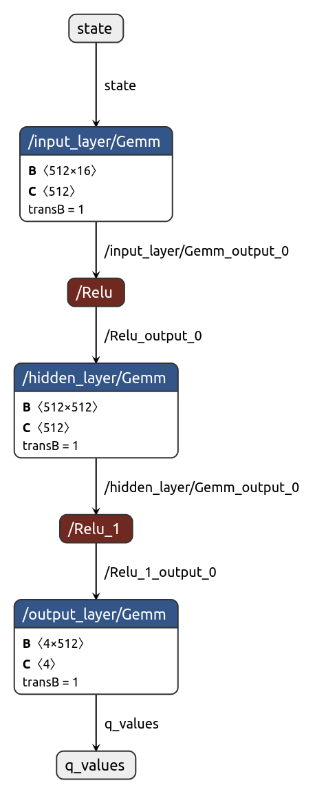

# Learn2Slither

## Sujet de l'exercice et mécanismes d'apprentissage :

**Objectif** : créer un agent qui apprend à jouer au *Snake* sur une grille 10x10 en maximisant une fonction de récompense. Le but pédagogique est d'implémenter un algorithme de **Q‑learning** (ici approché par un réseau de neurones) et de démontrer l'amélioration du comportement avec l'entraînement (modèles 1, 10, 100, ... sessions).


### Concepts de base : apprentissage par renforcement (RL)

Ce projet utilise les principes de l'apprentissage par renforcement (Reinforcement Learning, RL). Ci-dessous un rappel concis des concepts clefs et du cycle d'interaction agent/environnement, suivi d'un lien rapide avec le code du dépôt.

- Agent : l'entité qui prend des décisions (ici implémentée dans `Agent.py`).
- Environnement : le monde dans lequel l'agent agit (ici `SnakeGameAI` dans `game.py`).
- État (state) : représentation observée par l'agent à chaque pas (ici `game.get_state()` renvoie un tenseur `[1,16]`).
- Action : choix que l'agent peut effectuer (ici 4 actions correspondantes aux directions, gérées via `directions.py` et `Agent.get_action`).
- Récompense (reward) : signal numérique retourné par l'environnement après une action; guide l'apprentissage (valeurs dans `constantes.py`).
- Politique (policy) : stratégie de sélection d'actions; ici epsilon‑greedy (implémentée dans `Agent.get_action` et `helper.calc_epsilon`).
- Fonction de valeur / Q‑function : évalue la qualité d'une action dans un état; approximée ici par `Linear_QNet` (dans `model.py`).
- Épisode : séquence d'interactions s'arrêtant quand l'agent meurt ou qu'une condition terminale est atteinte. Le dépôt utilise des sessions/parties (`--sessions`).
- Exploration vs Exploitation : compromis géré par epsilon décroissant (plus d'exploration au début puis exploitation des meilleures actions).

Cycle RL (boucle par pas)
1. L'agent observe l'état s_t fourni par l'environnement.
2. L'agent choisit une action a_t selon sa politique (ex. epsilon‑greedy).
3. L'environnement exécute a_t, retourne la récompense r_t et le nouvel état s_{t+1}, et signale si l'épisode est terminé.
4. La transition (s_t, a_t, r_t, s_{t+1}, done) est stockée en mémoire (replay buffer).
5. L'agent met à jour sa représentation de la Q‑fonction (ou sa politique) à partir d'échantillons de la mémoire ou en apprentissage immédiat (short memory).
6. Répéter jusqu'à la fin de l'épisode, puis recommencer pour plusieurs épisodes (sessions).


### Principes d'apprentissage mis en œuvre :
- Représentation de l'état : pour chaque direction (haut, gauche, bas, droite) le réseau reçoit 4 valeurs -- distance au mur, distance au danger (corps ou situation dangereuse), distance à la pomme verte, distance à la pomme rouge -- formant un tenseur de forme `[1, 16]` (implémenté dans `game.py::get_state`).
- Politique d'action : epsilon‑greedy -- `Agent.get_action` utilise `calc_epsilon(n_games)` (dans `helper.py`) pour diminuer progressivement l'exploration et privilégier l'exploitation.
- Approximation de Q : un réseau fully-connected (`Linear_QNet` dans `model.py`) estime la valeur Q pour chaque action (4 sorties). Le forward renvoie les Q‑valeurs pour l'état en entrée.
- Mise à jour : `QTrainer.train_step` calcule la perte MSE entre la prédiction et la cible (reward + gamma * max Q(next_state)) et effectue la rétropropagation (optimiseur Adam). Les mises à jour sont appelées depuis `Agent.train_short_memory` (mise à jour immédiate) et `Agent.train_long_memory` (apprentissage par batch depuis la mémoire, voir `Agent.memory`).
- Mémoire et batchs : l'agent stocke les transitions dans une deque (`MAX_MEMORY`) et prélève des mini‑lots pour l'entraînement long afin de réduire la corrélation temporelle.

Réglages choisis / hyperparamètres (où ils se trouvent) :
- `constantes.py` contient `LR` (learning rate), `GAMMA` (discount), `MAX_MEMORY`, `BATCH_SIZE`, `SPEED`, et les valeurs de récompense (`reward_green_apple`, `reward_red_apple`, `reward_nothing`, `reward_game_over`, `reward_infini_boucle`).
- Architecture réseau : `Linear_QNet(16, 512, 4)` par défaut (entrée 16, une couche cachée large, sortie 4). C'est réglé dans `Agent.__init__`.
- Politique d'exploration : `calc_epsilon` (exponentielle) dans `helper.py` ; `Agent.get_action` l'utilise pour l'exploration.
- Sauvegarde / export : `Agent.save` écrit le `.pth` et un fichier `_info.json` contenant `n_games` ; les fichiers sont placés sous `./model/` et acceptent un chemin relatif (`--save best/last_model`).

Impact pratique de ces réglages : une architecture plus profonde/large et un entraînement long augmentent la capacité d'apprentissage (meilleure survie -> parties plus longues). Les récompenses et la détection de boucles influencent fortement le comportement (ta métrique "Nb boucle infinie" vient de `SnakeGameAI.detect_loop`).

### Notes CLI rapides

- `--save <name>` : nom (ou chemin relatif) du modèle de sortie (ne pas mettre l'extension `.pth`). Si `name` contient un sous-dossier (ex. `best/last_model`) le dossier sera créé sous `./model/` et les fichiers seront écrits dans `./model/best/` (ex. `./model/best/last_model.pth`, `./model/best/last_model_info.json`).
- `--load <name>` : charge le modèle `<name>.pth` depuis `./model/` (ex. `--load best/last_model`).
- `--no-learn` : mode évaluation (le réseau n'est pas mis à jour pendant les parties).
- `--no-graphic` : désactive Pygame (utile pour accélérer les runs batchs).
- `--sessions N` : nombre de sessions / parties à exécuter.
- `--verbose` : active quelques sorties explicites par partie (utile pour débug).
- `--step` : active le mode pas-à-pas (affiche la vision textuelle et attend ENTER entre étapes).

### Exemples de commandes

#### Pour l'entrainement

```python3
python main.py --save essais\essais --sessions 1000 --no-graphic
```

entrainement du modèle *essais* avec 1000 sessions sans graphique. Le modèle sera enregistré dans model/essais/essais.pth ainsi que les étapes 1, 10, 100, 1000 sous la forme :

- *model/essais/model_1_sessions.pth*
- *model_10_sessions.pth* etc...

il sauvegarde aussi :

- le diagram du réseau de neurone (_graph et _graph.png)
- la fin de la meilleur partie (meilleur score) dans _best_map.png
- les statistiques d'entrainement dans _stat.png
- une exportation en .onnx (pour visualisation avec [https://netron.app/](https://netron.app/))

#### Pour l'évaluation

```bash
# Évaluer un modèle en mode non-graphique (rapide)
python main.py --load best/last_model --no-learn --sessions 100 --no-graphic

# Évaluer un modèle avec l'interface graphique (par défaut)
python main.py --load best/last_model --no-learn --sessions 100

# Évaluer pas-à-pas (affiche la vision texte et attend ENTER entre étapes)
python main.py --load best/last_model --no-learn --sessions 10 --step
```

exemple de sortie:
```bash
    W       
    0       
    0       
W000HSS0000W
    0       
    0       
    0       
    0       
    0       
    R       
    G       
    W       
--------------------
           Wall    Danger  Apple_Green  Apple_Red
UP     0.333333  0.333333     1.000000   1.000000
LEFT   0.444444  0.444444     1.000000   1.000000
DOWN   0.888889  0.888889     0.777778   0.666667
RIGHT  0.777778  0.111111     1.000000   1.000000
direction : LEFT, relative_move = STRAIGHT

```

---

### justifications techniques

#### Où se trouvent les éléments liés au Q‑learning ?

- Implémentation du réseau et de l'entraînement : `model.py`
  - `Linear_QNet` : définition du réseau (méthode `forward`) — c'est la fonction Q approximée.
  - `QTrainer.train_step` : calcule la perte MSE et met à jour les poids (backprop). C'est l'algorithme d'update de la Q‑function.
- Gestion de l'agent et apprentissage : `Agent.py`
  - `Agent.get_action` : applique une stratégie epsilon‑greedy (`calc_epsilon`) pour exploration/exploitation.
  - `Agent.train_short_memory` et `Agent.train_long_memory` : mettent à jour le réseau à court terme (pas par pas) et par batch (mémoire), en appelant `QTrainer.train_step`.
  - `Agent.save` / `Agent.load` : export/import de l'état du modèle (fichiers `.pth` + `_info.json`).
- Utilitaires : `helper.py` contient `calc_epsilon` (politique d'exploration) et la fonction `plot` pour visualiser l'évolution des scores.

Ces fichiers montrent que la Q‑function est approchée par un réseau (Linear_QNet) et qu'elle est mise à jour par les pas d'entraînement définis dans `QTrainer` via les méthodes de `Agent` 

#### Structure technique

- `game.py` : l'environnement / board (IV.1). Contient la logique du plateau, placement des pommes, détection de collision, affichage Pygame (`SnakeGameAI`).
- `Agent.py` : l'agent RL (IV.5). Mémoire, politique d'action, apprentissage long/short, save/load.
- `model.py` : réseau et routine d'entraînement (Linear_QNet, QTrainer) — coeur du Q‑learning.
- `helper.py` : utilitaires (epsilon, affichage des plots, fonctions de debug comme `print_tensor`).
- `main.py` : orchestrateur / interface CLI. Parse les arguments, crée l'agent et l'environnement, lance `play()`.
- `constantes.py` : paramètres globaux (taille du board, récompenses, chemins — `MODEL_FOLDER_PATH`).

Cette organisation modulaire facilite l'évaluation (chaque partie du sujet est localisée dans un fichier distinct) .

### Résultats des essais d'entrainement

| Model | couches neurones |          vue               | Nb entrainement | Nb game test | durée | Best score | Moyenne | Loop |
|-------|----------|----------------------------|-----------------|--------------|-------|------------|--------|------|
| best  | 16-512-4 | 4 x dist dangers + Green A |       150000    |      1000   |  492  |     53     |  18.83  | 28% |




## liens

[https://8thlight.com/insights/qlearning-teaching-ai-to-play-snake](https://8thlight.com/insights/qlearning-teaching-ai-to-play-snake)

[https://medium.com/@nancy.q.zhou/teaching-an-ai-to-play-the-snake-game-using-reinforcement-learning-6d2a6e8f3b1c](https://medium.com/@nancy.q.zhou/teaching-an-ai-to-play-the-snake-game-using-reinforcement-learning-6d2a6e8f3b1c)
